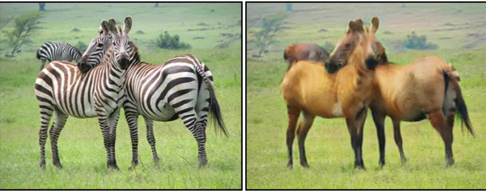

## CycleGAN Model : Horse to Zebra and Zebra to Horse Image Translation

CycleGAN is a type of generative adversarial network that enables image-to-image translation between two domains without requiring paired examples. 

This project applies CycleGAN to translate images between **horses** and **zebras**, learning to convert one to the other while preserving key features like shape and texture.

The model utilizes two generators and two discriminators to enforce a cycle consistency loss, ensuring that translated images can be converted back to their original form.
